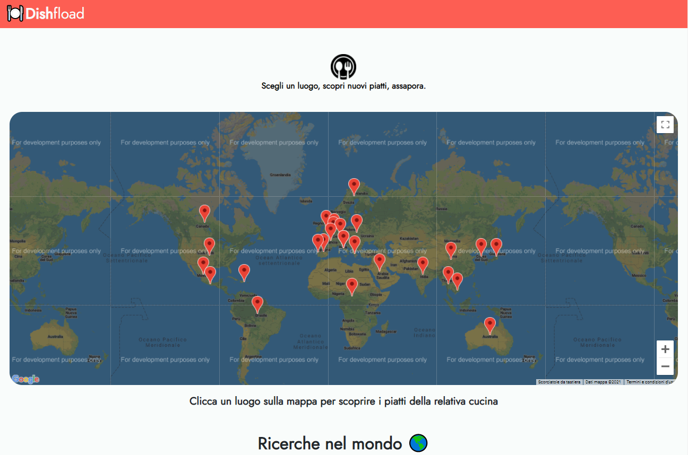
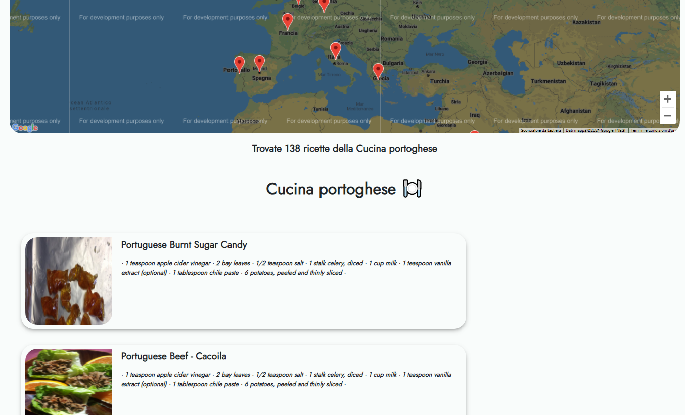
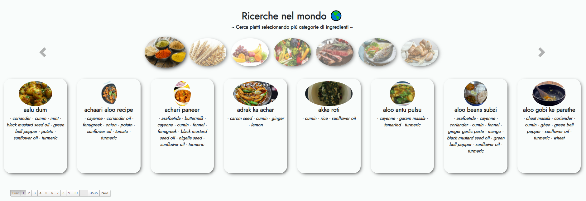
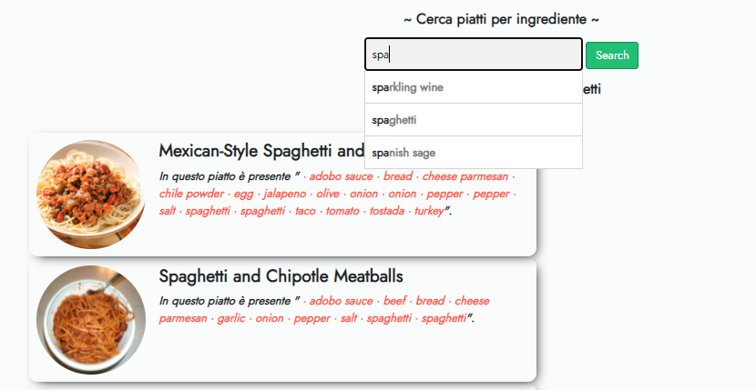
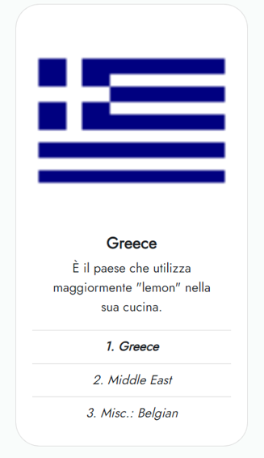

# DishFload
>Una navigazione intuitiva alla scoperta di sapori provenienti da 22 tipiche cucine sparse nel mondo.  
>Ricerche, statistiche e ricette su oltre  45 000 piatti.
 

## Funzionalità
### Mappe delle cucine
Clicca un luogo sulla mappa e visualizza tutti i piatti tipici della zona selezionata.

### Ingredienti più usati
Podio dei primi 3 ingredienti più usati per la nazione scelta.

### Piatti per categorie
Cerca piatti selezionando le categorie di cibi a cui appartengono.

### Cerca piatti per ingrediente
Ricerca tutti i piatti che contengono l’ ingrediente specificato.

### Paese con maggior consumo
Scopri la nazione che abusa di più del prodotto scelto.

## Configurazione
- Eseguire con NodeJS il populator "tmppop.js" 
- Avviare successivamente il server eseguendo "app.js" 

NB: Fornire una key valida per bing-image-search per visualizzare le immagini di ciascun piatto

## Dataset:
Tutti i file csv sono stati scaricati da [CulinaryDB](https://cosylab.iiitd.edu.in/culinarydb/).

## Altro
Repository del progetto completo su [Github](https://github.com/Fernet97/queryFood). 
Tutti i file csv devono essere caricati nella cartella *CulinaryDB*.

**Authors**
- Pierluigi Liguori
- Fabiano Priore
- Antonello Luppolo

Università degli Studi di Salerno
